## 初衷
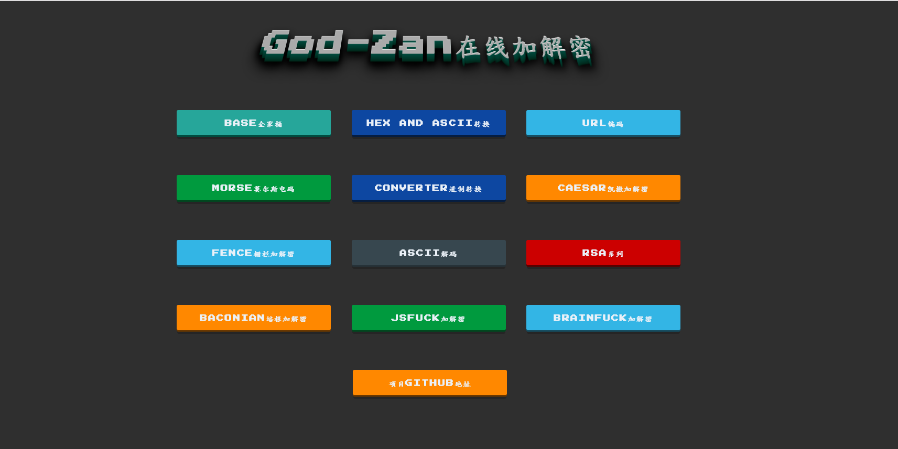

只是一些简单的加密解密，基于django2,主要是太菜了想学一学css,所以没怎么用前端框架，其次是防止没外网的情况下能本地跑跑，有尝试过拿python的gui桌面应用比如pyqt，但是太丑了（orz技术太差，还有就是打包也贼大ε=ε=ε=┏(゜ロ゜;)┛  
[线上地址传送门](http://106.15.177.94:9999/)


#### 运行
```
git clone https://github.com/Kit4y/Crypto-Tools.git
cd Crypto-Tools
pip install -r requirements.txt
cd godZan
python manage runserver 
```
然后访问`localhost:8000`
### 目前功能

#### 1、BASE家族
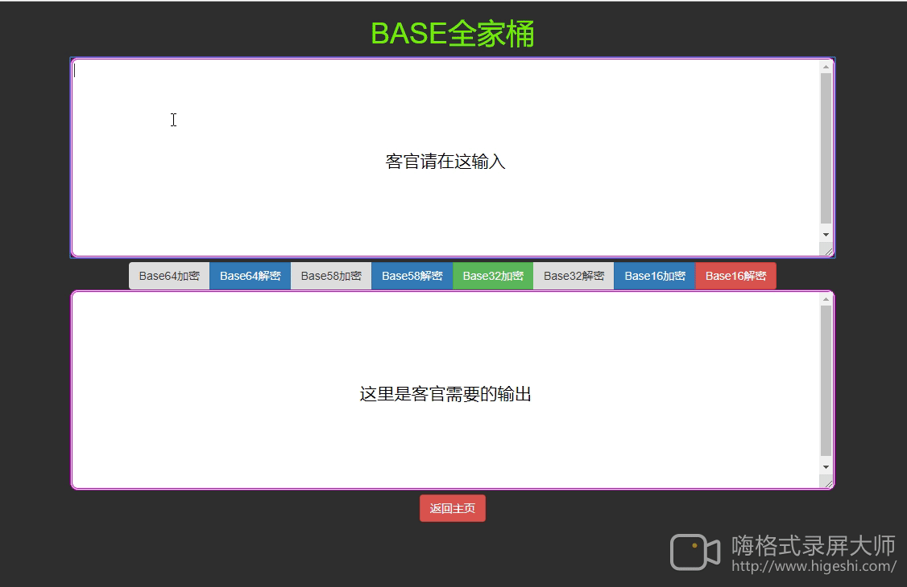

#### 2、Hex编码


#### 3、URL编码
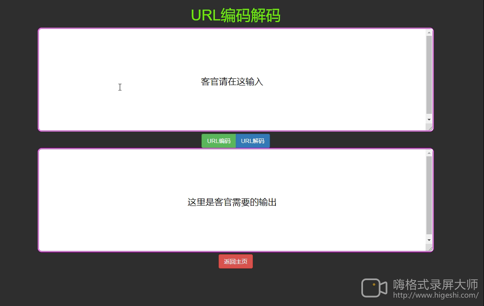


#### 4、摩尔斯编码
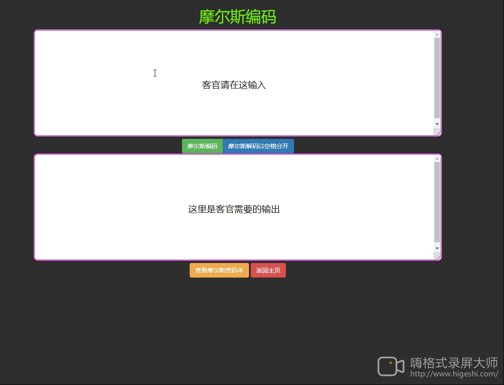

#### 5、超大数的进制转换
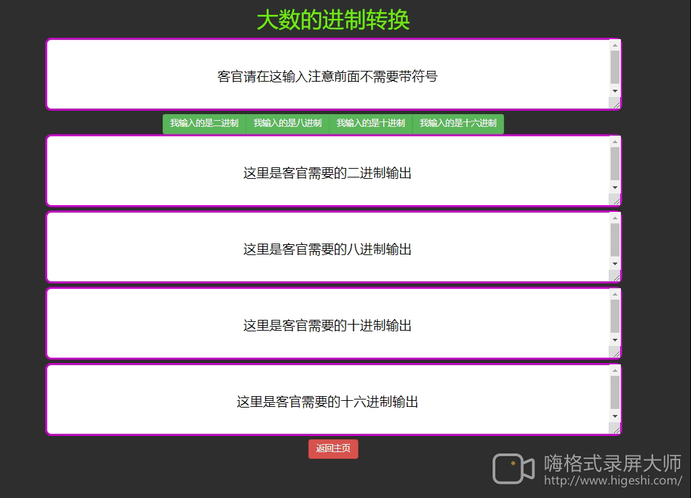

#### 6、凯撒加解密
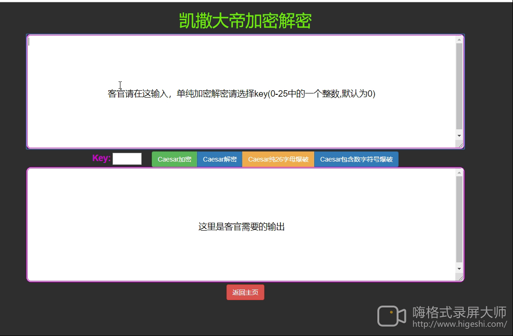

#### 7、栅栏加解密
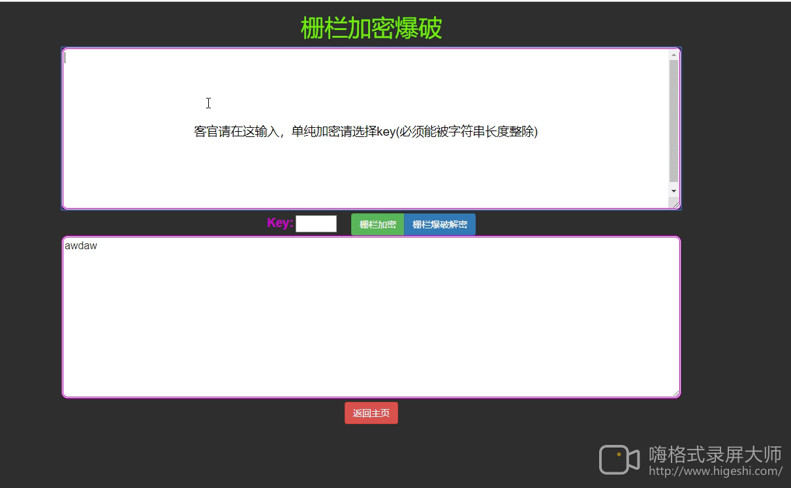

#### 8、RSA计算D或E(分解模数)
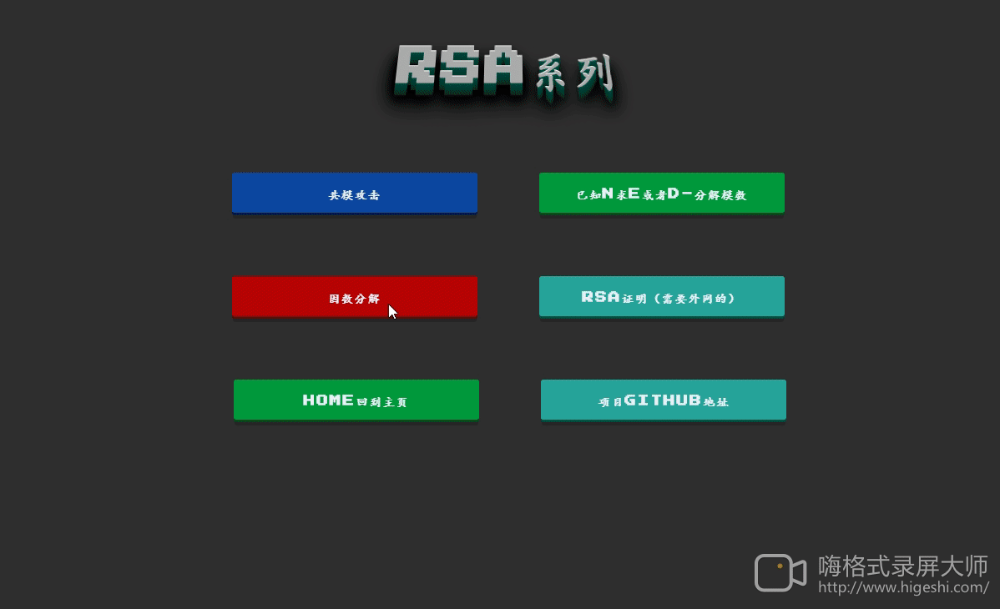

#### 9、共模攻击
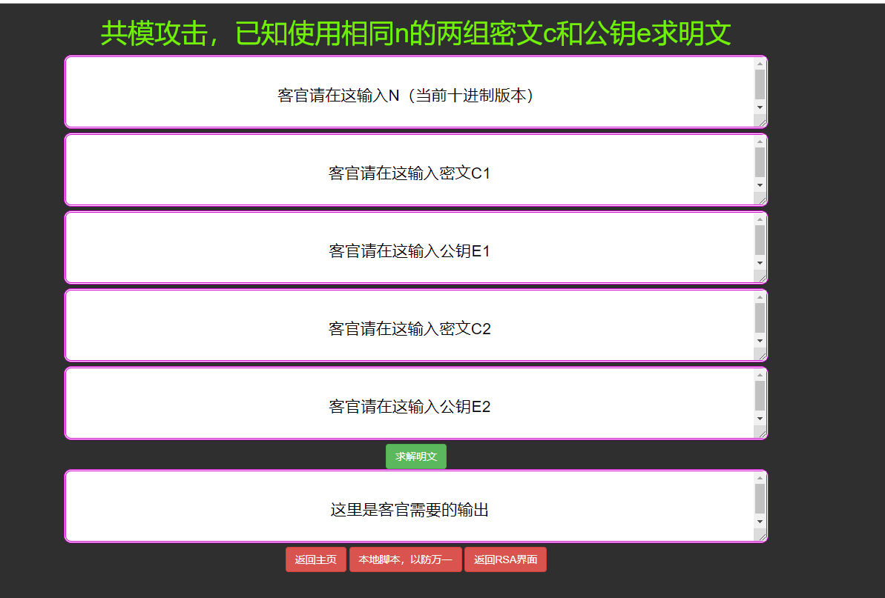

#### 10、培根加密
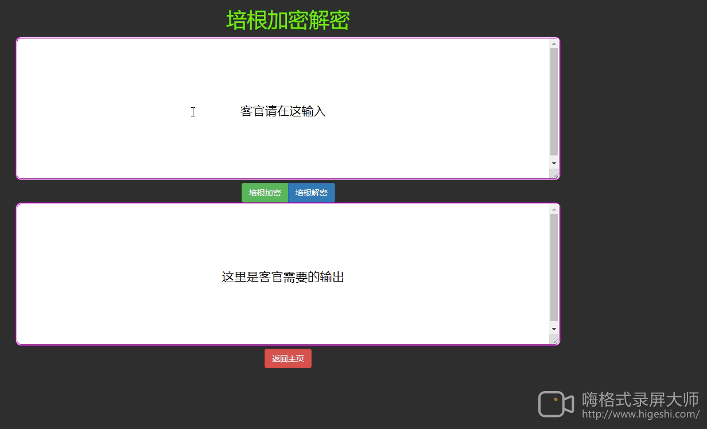

#### 11、JSfuck加密
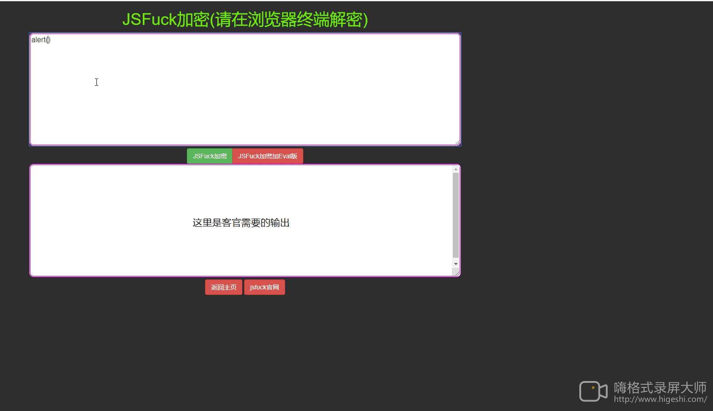

#### 12、维吉尼亚/AutoKey
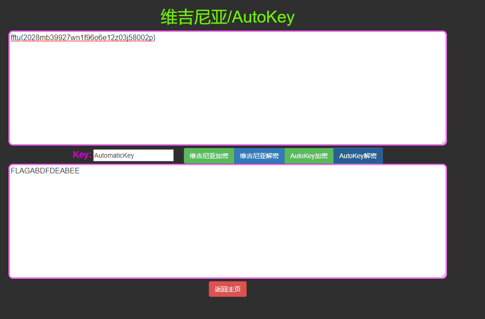

