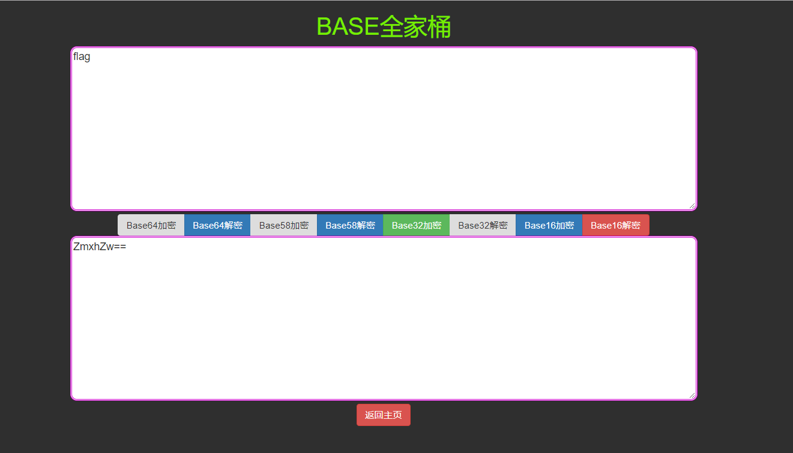
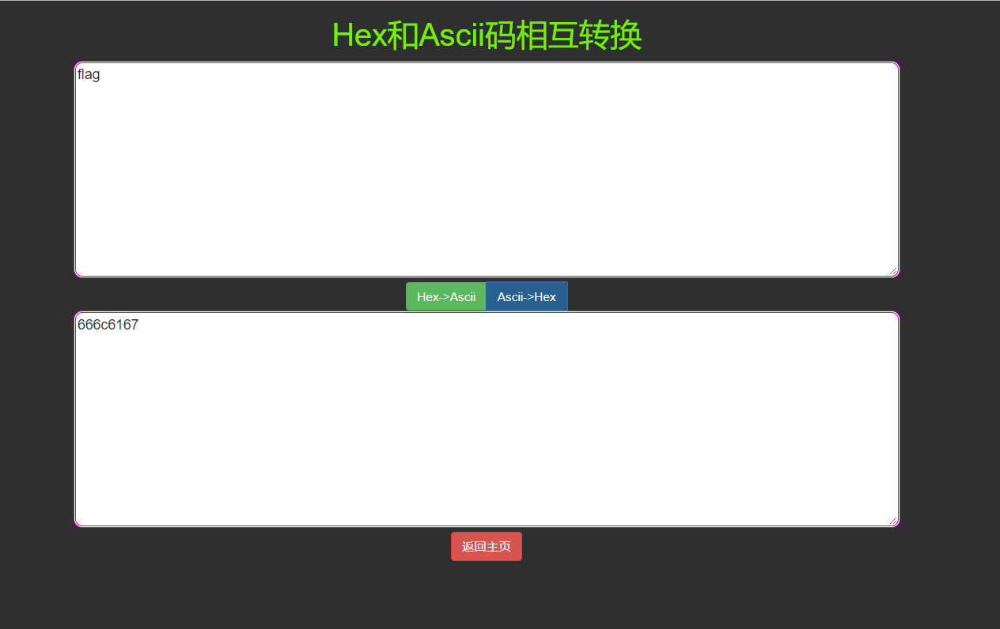
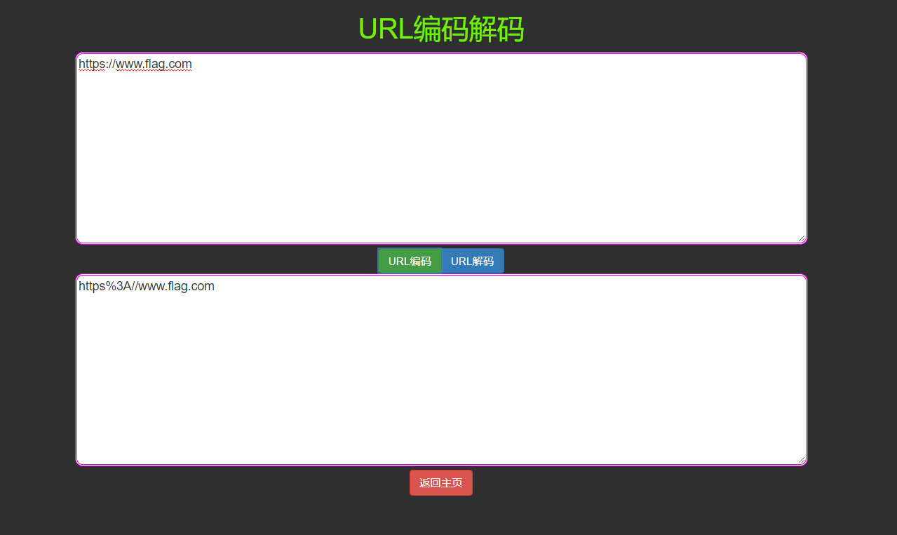
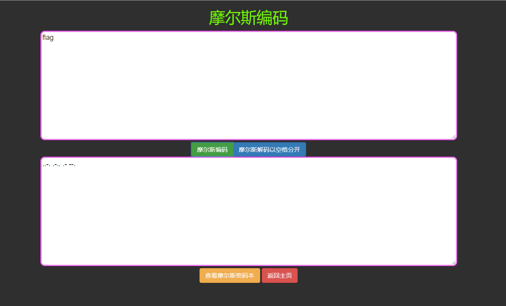
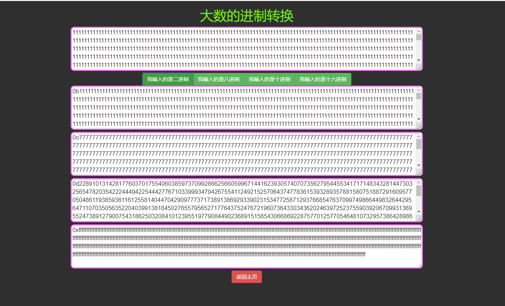

## 初衷

只是一些简单的加密解密，基于django2,主要是太菜了想学一学css,所以没怎么用前端框架，其次是防止没外网的情况下能本地跑跑，有尝试过拿python的gui桌面应用比如pyqt，但是太丑了（orz技术太差，还有就是打包也贼大ε=ε=ε=┏(゜ロ゜;)┛  

## 目前功能

#### 1、BASE家族

#### 2、Hex编码

#### 3、URL编码

#### 4、摩尔斯编码

#### 5、超大数的进制转换
